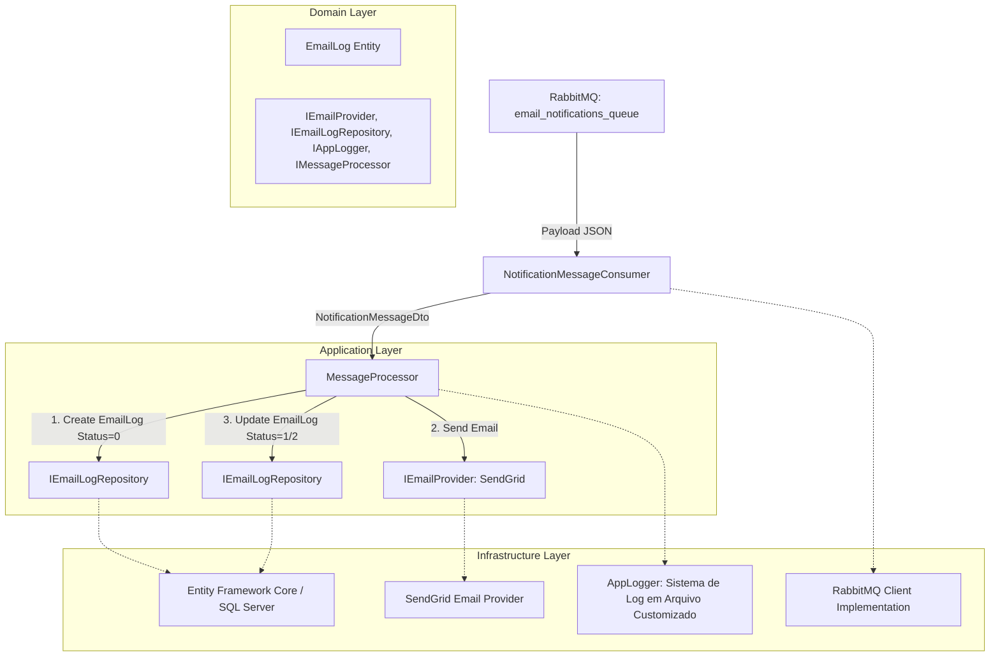

# Visão Geral da Arquitetura - NotificationService

Este documento descreve o estado atual da arquitetura do serviço de notificações e identifica melhorias necessárias para atingir um nível de robustez empresarial.

## Fluxograma de Processamento

Abaixo, o fluxo de uma notificação desde a chegada na fila do RabbitMQ até a persistência final.

## Análise de Lacunas (Gap Analysis)

Com base na análise do código, foram detectadas as seguintes ausências ou oportunidades de melhoria:

### 1. Robustez e Resiliência
- **Mecanismo de Retry**: Atualmente, se o provedor de e-mail falha, o status é marcado como `Failed` e o processo encerra. É recomendável implementar uma política de retentativas (ex: Exponential Backoff) usando **Polly** ou uma fila de reprocessamento.
- **Dead Letter Queue (DLQ)**: Embora o consumidor dê Nack em caso de erro sistêmico, não há uma configuração explícita de DLQ para isolar mensagens malformadas ou que excederam o limite de erros.
- **Circuit Breaker**: Para evitar chamadas inúteis a provedores externos (SendGrid/Twilio) quando estes estão fora do ar.

### 2. Funcionalidades de Notificação
- **Canais Adicionais**: O sistema está focado em E-mail. Falta suporte para **SMS** (Twilio/Zenvia), **WhatsApp (API)** e **Push Notifications** (Firebase/OneSignal).
- **Motor de Templates**: A interface `IEmailTemplateRenderer` existe, mas não está integrada ao `MessageProcessor`. Utilizar **RazorLight** ou **Fluid** permitiria e-mails dinâmicos baseados em templates HTML.
- **Anexos**: Não há suporte para envio de arquivos anexos nas notificações.

### 3. Gestão e Monitoramento
- **API de Consulta**: Faltam endpoints para consultar o histórico de envios ou o status de uma notificação específica por `CorrelationId` ou `Id`.
- **Dashboard/Métricas**: Integração com ferramentas como **Prometheus/Grafana** ou uma interface simples para visualizar volumes de envio e taxas de erro.
- **Multitenancy**: Se o serviço for usado por múltiplos sistemas, seria ideal separar as configurações por "App" ou "Tenant".

### 4. Melhores Práticas de Engenharia
- **Correlation ID**: Importante para rastrear uma notificação desde o sistema de origem até o envio final.
- **Testes de Integração**: Expandir os testes para cobrir o fluxo completo com o RabbitMQ real (usando Testcontainers, por exemplo).
- **Consumo em Batch**: Dependendo do volume, processar mensagens em lotes pode ser mais eficiente que individualmente.

### 5. Escalabilidade Avançada (Roadmap Futuro)
Caso o fluxo de mensagens cresça exponencialmente e atinja volumetrias gigantes (ex: Black Friday), os seguintes itens são recomendados para a proteção do ecossistema:
- **Idempotência (Proteção contra Duplicidade):** Implementar dupla verificação (no Cache ou BD local usando o `CorrelationId`) para que mensagens atiradas duas vezes na rede pelo sistema cliente não disparem SMS/Emails duplicados de madrugada.
- **Rate Limiting Interno:** Acoplar limitadores (Token Bucket) além do Semaphore, para evitar que o envio de e-mails em massa acabe gerando bloqueios na API do Twilio ou SendGrid (`HTTP 429 Too Many Requests`).
- **Data Retention / Expurgo Analítico:** `NotificationLogs` crescerá num ritmo acelerado. Criar um mecanismo passivo (Hangfire/Worker) para expurgar e-mails antigos para um *Cold Storage* após 60/90 dias, mantendo o banco operacional veloz.
- **Filas de Prioridade (Priority Queues):** Passar a priorizar através do RabbitMQ mensagens de Redefinição de Senha que não podem concorrer com o gargalo e atraso gerados por campanhas enormes de Marketing.
- **Localização Nativa:** Encadeamento de *Dicionário de Idiomas*, capacitando o *Fluid* a selecionar a linguagem alvo dinamicamente via `CultureInfo` antes de processar sua renderização em PT-BR, ES, EN etc.

---
> [!NOTE]
> O projeto segue bem os princípios de **Clean Architecture** e **DDD**, o que facilita a implementação de qualquer um dos itens acima sem grandes refatorações.
